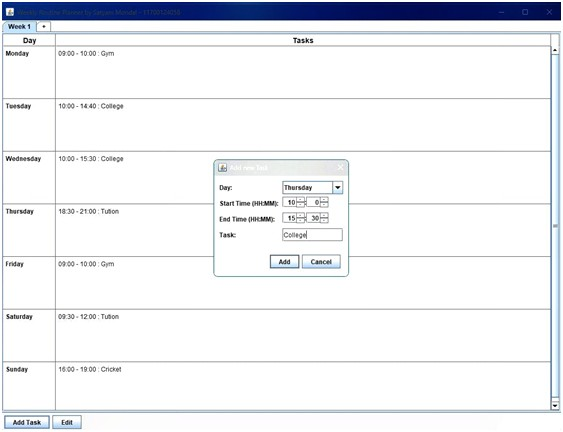
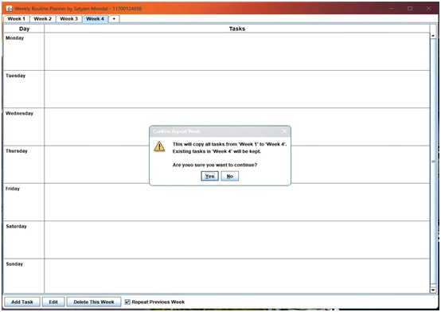

# 📅 Weekly Routine Planner (Java Swing)

This is a **GUI desktop application** built in Java Swing that allows a user to automatically set up and manage a detailed daily routine across multiple weeks.

This project serves as a strong demonstration of integrating **Java's Collection Framework**, **Generics**, and **AWT/Swing event handling** into a cohesive desktop tool.

## 🖥️ Application Overview

The application features a tabbed interface for managing different weeks and a custom-rendered JTable for viewing scheduled tasks.

 

---

## ✨ Core Features and Functionality

### 1. Multi-Week Management and Navigation
* [cite_start]**Dynamic Week Addition:** New weeks (`Week 2`, `Week 3`, etc.) are created by clicking the **`+`** tab[cite: 8].
* **Sequential Naming:** Weeks are automatically named and renamed sequentially upon creation or deletion.
* [cite_start]**Week Deletion:** The **"Delete This Week"** button allows users to remove any redundant week (excluding Week 1) after confirming the action[cite: 8].

### 2. Task Management (CRUD)
The application provides full control over task entries via dedicated dialogs, ensuring clean separation from the main viewing table.

* [cite_start]**Add Tasks:** Clicking **"Add Task"** opens a dedicated dialog [cite: 2] where the user enters the day, start/end times, and task details.
    * **Screenshot Example:** 
    * *Result:* The new task is appended to the corresponding day's cell.
    * **Data Integrity & Validation:** Prevents blank tasks and enforces that the **end time is strictly after the start time**.

* [cite_start]**View & Multi-line Display:** Tasks are clearly displayed in the table, supporting multiple entries per day[cite: 4].
* **Edit Tasks:**
    * [cite_start]By selecting a day (row) and clicking **"Edit"**, a prompt appears[cite: 5].
    * [cite_start]If a day has multiple tasks, a dropdown menu allows the user to select the specific task to modify[cite: 6, 12].
    * [cite_start]Users can then change the time, activity, or **shift the task to a different day**[cite: 7, 8].
        * **Screenshot Example:** 
        * *Result:* Users can change the time, activity, or even shift the task to a different day.

    * **Delete Week:** A **"Delete This Week"** button provides safe removal of any week except Week 1.

### 3. Automatic Schedule Copying
* **Repeat Previous Week:** The **"Repeat Previous Week"** checkbox handles copying data from any prior week to the current one.
* [cite_start]**Source Selection:** If the current week is **Week 3 or later**, a dropdown menu appears, allowing the user to select *which* previous week (e.g., Week 1, Week 2) should be copied[cite: 10, 12].
* [cite_start]**Data Appending:** Copied tasks are **appended** to the current week's schedule without deleting existing entries[cite: 13].
    * **Screenshot Example:** 
    * *Result:* All tasks from the chosen week are copied into the current week, preserving existing tasks.
    
---

## 🛠️ Technologies Used

| Component | Java Tool | Role in Application |
| :--- | :--- | :--- |
| **Data Structure** | `List<Map<String, List<RoutineEntry<String>>>>` | Manages data for multiple weeks, days, and tasks using the **Collection Framework**. |
| **Data Model** | `RoutineEntry<T>` (using **Generics**) | Ensures type safety and provides a clean `toString()` method for display in the UI. |
| **Task Dialog** | `JDialog` with Factory Methods | Reusable modal dialog for both adding and editing tasks. |
| **Interface** | `JTabbedPane` | Manages switching between different weeks. |
| **Visuals** | `MultiLineCellRenderer` | Custom renderer for `JTable` enabling **multi-line text wrapping** and applying visual styles (like alternating row colors). |


---


## 🚀 How to Run

1.  **Prerequisites:** You must have a Java Development Kit (JDK) installed on your system.
2.  **Clone the Repository:** Download or clone the project files.
3.  **Compile:** Open a terminal or command prompt in the directory *containing* the `SwingGUIWork` folder and run:

    ```bash
    javac SwingGUIWork/*.java
    ```
4.  **Run:** Execute the main application file:
    ```bash
    java SwingGUIWork.DailyRoutineGUI
    ```

---
